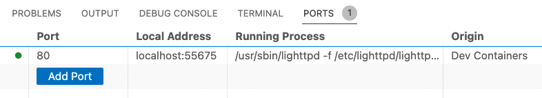

# The JavaScript Way - Starter code

This repository contains the initial code structure for [The JavaScript Way](https://thejsway.net) book.

## Using a containerized environment

If you use Visual Studio Code, you can obtain a ready-to-use work environment by following these steps:

1. Install [Docker Desktop](https://docs.docker.com/desktop/) on your local machine. Depending on your operating system, a few post-install configuration steps may be necessary. Once it's done, start Docker Desktop.
1. To use this repository in a container, you can either clone it in an isolated Docker volume:

   - Open the Command Palette in the `View` menu of Visual Studio Code, then select the **Dev Containers: Clone Repository in Container Volume...** command.
   - Enter <https://github.com/thejsway/thejsway-starter-code> as the repository URL and wait for the container to be set up.

   Or open a locally cloned copy of the repo:

   - Clone this repository to your local filesystem.
   - In the Visual Studio Code Command Palette, select the **Dev Containers: Open Folder in Container...** command.
   - Select the cloned copy of this folder and wait for the container to be set up.

For chapters using the browser to execute JavaScript code: in the `Ports` tab of Visual Studio Code, click on the **Local Address** link to open a browser tab. Then, navigate to the desired chapter and open any HTML file to execute the corresponding JS code.

For chapters using [Node.js](https://nodejs.org) to execute JavaScript code: use the Visual Studio Code terminal.

> Feeling curious? Here is more info about [containerized environments](https://code.visualstudio.com/docs/devcontainers/containers), their [creation](https://code.visualstudio.com/docs/devcontainers/create-dev-container) and their [usage in VS Code](https://github.com/microsoft/vscode-remote-try-node).
